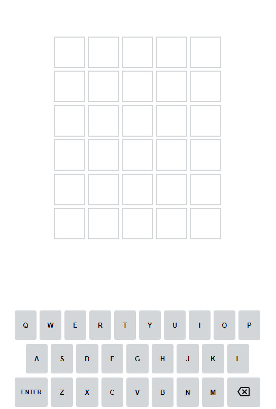

# wordleSuggest
wordleSuggest is a chrome extension that adds a autosuggest/autocomplete feature to your Wordle game. Simply add it to chrome,
and it just works. This extension is only meant to be a quality of life addition to the Wordle game, and suggestions
are taken alphabetically from the list of possible words.

## How It Works
Simply add the extension to chrome, and it will run when Wordle is opened. You can press Tab to cycle through
suggestions alphabetically.

## Installation
For now, in order to install the extension, you'll have to download the repo, and add it to chrome as an unpacked extension.

## TO DOs
- [x] Basic functionalities (autocomplete, and cycle through suggestions) 3/28/2022
- [x] Move to MVC structure 3/29/2022
- [ ] An actual Logo.
- [ ] Word search performance optimzations.
- [ ] Complete documetations.
- [ ] Settings action menu.
- [ ] Smarter word search (using given hints to narrow searches).
