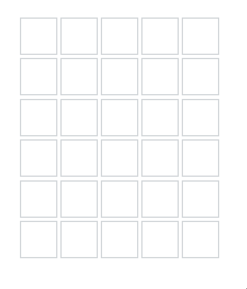

# Wordle Suggest
wordleSuggest is a chrome extension that adds a autosuggest/autocomplete feature to your Wordle game. Simply add it to chrome,
and it just works. This extension is only meant to be a quality of life addition to the Wordle game, and suggestions
are taken alphabetically from the list of possible words.

## How It Works
Simply add the extension to chrome, and it will run when Wordle is opened. You can press Tab to cycle through
suggestions alphabetically.

Works on: https://www.nytimes.com/games/wordle/index.html

## Installation
Install the extension via the chrome webstore.
https://chrome.google.com/webstore/detail/wordlesuggest/gglbpeofjcjkofejocefcncolhkldhom

## TO DOs
- [x] Basic functionalities (autocomplete, and cycle through suggestions) 3/28/2022
- [x] Move to MVC structure 3/29/2022
- [x] Refractor code for readability. 3/30/2022
- [x] Added to Chrome Web Store (in progress)
- [x] An actual Logo.
- [x] Word search performance optimzations.
- [x] Completed documetations.
- [ ] Include instructions.
- [ ] Settings action menu.
- [ ] Smarter word search (using given hints to narrow searches).
